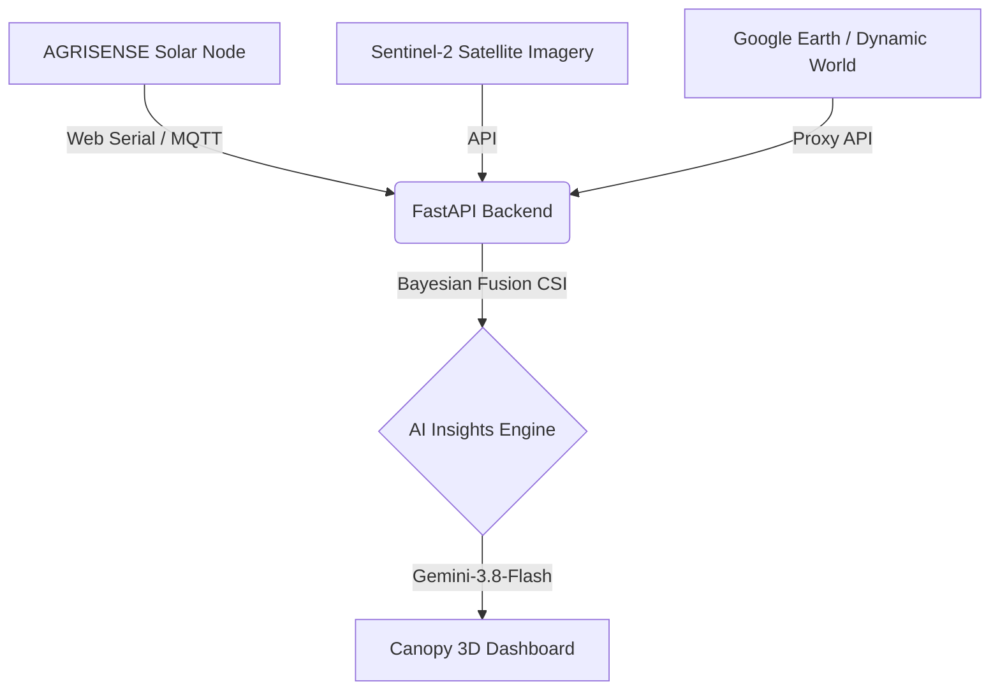

# Canopy — Global Vegetation Health Monitor

*(Hardware platform: AGRISENSE)*

[Live Demo](https://smart-plant-health-monitoring-using-solar-images-82n-8ca4j55i0.vercel.app/)

Canopy is a scalable platform merging hardware telemetry with global satellite imagery to provide continuous, real-time vegetation health monitoring for precision agriculture.

## Architecture



## Features

- **[Live] Ground-to-Orbit Fusion:** CapSense node data merged with Sentinel-2 NDVI.
- **[Live] Interactive 3D Visualization:** Real-time WebGL global environment map.
- **[Live] AI-Synthesized Insights:** Automated stress, disease, and nutrient deficiency reporting via LLM.
- **[Simulated] Multi-Spectrum Proxies:** Land-use proxying when Earth Engine is rate-limited.
- **[Proxy] Local Fallbacks:** Seamless UI functionality independent of external network failures.

## Quick Start

```bash
npm install && npm start
```

## Environment Variables

Create a `.env` file in the root:

```
NEXT_PUBLIC_API_URL=http://localhost:8000
GEMINI_API_KEY=your_gemini_key
SENTINEL_HUB_CLIENT_ID=your_id
SENTINEL_HUB_CLIENT_SECRET=your_secret
```

## Project Structure

- `website/`: Next.js WebGL frontend dashboard.
- `backend/`: FastAPI Python server (Dual-Engine API).
- `algorithm/`: ML data fusion and Bayesian CSI logic.
- `docs/`: Evaluation metrics, model cards, and dataset details.

## Limitations

- Satellite processing latency introduces a 12-48 hour delay on absolute ground truth updates pending Sentinel passes.
- Simulated indices currently proxy certain multispectral bands until additional proprietary datasets are fully evaluated.

## License

MIT License
